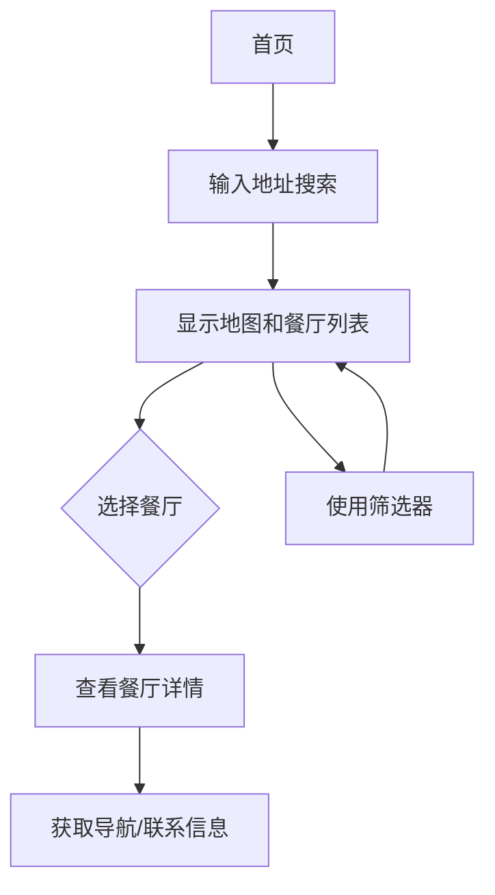

## 1. 产品概述
"等会吃什么"是一个帮助用户快速找到附近餐厅的网页应用。用户只需输入地址，即可获取该地点方圆500米内的所有餐厅信息，解决"今天吃什么"的日常难题。

目标用户：所有需要寻找附近餐厅的人群，特别适合在陌生区域或想要尝试新餐厅的用户。

## 2. 核心功能

### 2.1 用户角色
本产品为工具类应用，无需用户注册登录即可使用核心功能。

### 2.2 功能模块
本应用包含以下核心页面：
1. **首页**：地址搜索、地图展示、餐厅列表
2. **餐厅详情页**：餐厅信息、联系方式、营业时间

### 2.3 页面详情
| 页面名称 | 模块名称 | 功能描述 |
|---------|---------|---------|
| 首页 | 搜索栏 | 输入地址或地点名称，支持自动补全 |
| 首页 | 地图展示 | 显示搜索地点和500米范围圈，标记餐厅位置 |
| 首页 | 餐厅列表 | 显示附近餐厅卡片，包含名称、评分、距离、菜系 |
| 首页 | 筛选器 | 按菜系、价格区间、评分筛选餐厅 |
| 餐厅详情页 | 基本信息 | 显示餐厅名称、地址、电话、营业时间 |
| 餐厅详情页 | 地图导航 | 显示餐厅具体位置和导航路线 |
| 餐厅详情页 | 用户评价 | 显示用户评分和评论 |

## 3. 核心流程
用户操作流程：
1. 用户进入首页，在搜索框输入目标地址
2. 系统定位到该地址，在地图上显示500米范围圈
3. 系统加载并显示范围内所有餐厅
4. 用户可通过筛选器缩小选择范围
5. 点击餐厅卡片查看详细信息
6. 可获取导航路线或联系电话

## 4. 用户界面设计

### 4.1 设计风格
- **主色调**：温暖橙色(#FF6B35)搭配白色背景，营造食欲感
- **按钮样式**：圆角矩形，悬停效果，主要操作用橙色
- **字体**：优先使用系统默认字体，标题16-18px，正文14px
- **布局风格**：卡片式布局，顶部搜索栏，下方地图和列表并排显示
- **图标风格**：使用简洁的线性图标，如地图标记、星级评分等

### 4.2 页面设计概览
| 页面名称 | 模块名称 | UI元素 |
|---------|---------|--------|
| 首页 | 搜索栏 | 白色背景，橙色搜索按钮，占位文字"输入地址找餐厅" |
| 首页 | 地图区域 | 左侧占屏60%，显示高德/谷歌地图，橙色500米范围圈 |
| 首页 | 餐厅列表 | 右侧占屏40%，垂直滚动卡片，每张卡片包含餐厅图片、名称、评分星标、距离标签 |
| 首页 | 筛选器 | 顶部标签式筛选，包含菜系、价格、评分选项 |
| 餐厅详情页 | 头部图片 | 全宽餐厅图片，高度200px，渐变遮罩 |
| 餐厅详情页 | 信息卡片 | 白色圆角卡片，包含所有基本信息，图标+文字形式 |

### 4.3 响应式设计
采用桌面端优先设计，在移动端自适应为单列布局：
- 平板：地图和列表上下排列
- 手机：地图全屏，列表可上滑展开
- 触摸优化：增大按钮点击区域，支持手势操作地图