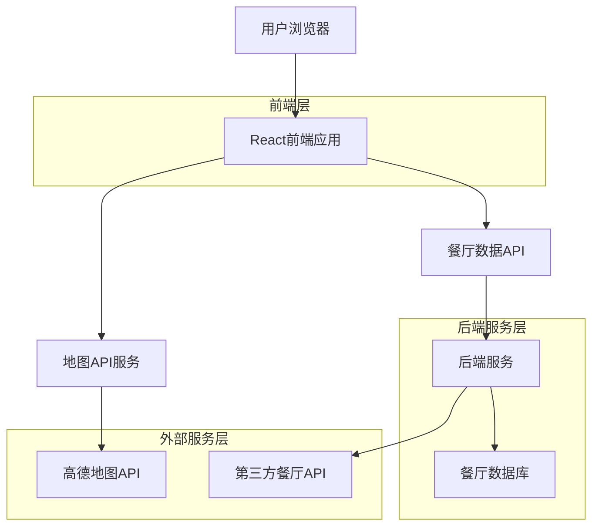
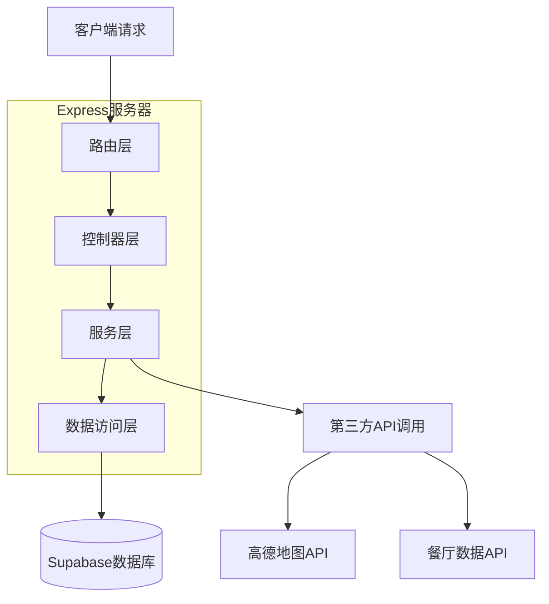
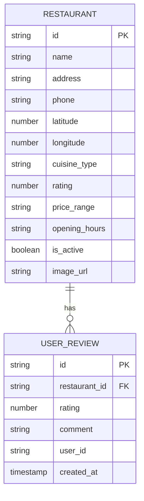

## 1. 架构设计



## 2. 技术描述

- **前端**: React@18 + TailwindCSS@3 + Vite
- **初始化工具**: vite-init
- **后端**: Express@4 (Node.js)
- **数据库**: Supabase (PostgreSQL)
- **地图服务**: 高德地图API
- **部署**: Vercel (前端) + Railway (后端)

## 3. 路由定义

| 路由 | 用途 |
|-------|---------|
| / | 首页，包含搜索和地图功能 |
| /restaurant/:id | 餐厅详情页，显示具体餐厅信息 |
| /api/search | API路由，搜索地址坐标 |
| /api/restaurants | API路由，获取附近餐厅数据 |

## 4. API定义

### 4.1 核心API

地址搜索API
```
GET /api/search/location
```

请求参数:
| 参数名 | 参数类型 | 是否必需 | 描述 |
|-----------|-------------|-------------|-------------|
| address | string | true | 搜索的地址字符串 |

响应:
| 参数名 | 参数类型 | 描述 |
|-----------|-------------|-------------|
| latitude | number | 纬度坐标 |
| longitude | number | 经度坐标 |
| formatted_address | string | 格式化地址 |

示例
```json
{
  "latitude": 31.2304,
  "longitude": 121.4737,
  "formatted_address": "上海市黄浦区南京东路123号"
}
```

获取附近餐厅API
```
GET /api/restaurants/nearby
```

请求参数:
| 参数名 | 参数类型 | 是否必需 | 描述 |
|-----------|-------------|-------------|-------------|
| lat | number | true | 中心点纬度 |
| lng | number | true | 中心点经度 |
| radius | number | false | 搜索半径(米)，默认500 |
| cuisine | string | false | 菜系筛选 |
| price_range | string | false | 价格区间筛选 |

响应:
| 参数名 | 参数类型 | 描述 |
|-----------|-------------|-------------|
| restaurants | array | 餐厅列表 |
| total_count | number | 总数 |

## 5. 服务器架构图



## 6. 数据模型

### 6.1 数据模型定义



### 6.2 数据定义语言

餐厅表 (restaurants)
```sql
-- 创建餐厅表
CREATE TABLE restaurants (
    id UUID PRIMARY KEY DEFAULT gen_random_uuid(),
    name VARCHAR(255) NOT NULL,
    address TEXT NOT NULL,
    phone VARCHAR(20),
    latitude DECIMAL(10, 8) NOT NULL,
    longitude DECIMAL(11, 8) NOT NULL,
    cuisine_type VARCHAR(50),
    rating DECIMAL(2, 1) DEFAULT 0,
    price_range VARCHAR(10) DEFAULT '中等',
    opening_hours TEXT,
    is_active BOOLEAN DEFAULT true,
    image_url TEXT,
    created_at TIMESTAMP WITH TIME ZONE DEFAULT NOW(),
    updated_at TIMESTAMP WITH TIME ZONE DEFAULT NOW()
);

-- 创建空间索引
CREATE INDEX idx_restaurants_location ON restaurants(latitude, longitude);
CREATE INDEX idx_restaurants_cuisine ON restaurants(cuisine_type);
CREATE INDEX idx_restaurants_rating ON restaurants(rating DESC);

-- 设置权限
GRANT SELECT ON restaurants TO anon;
GRANT ALL PRIVILEGES ON restaurants TO authenticated;
```

用户评价表 (user_reviews)
```sql
-- 创建评价表
CREATE TABLE user_reviews (
    id UUID PRIMARY KEY DEFAULT gen_random_uuid(),
    restaurant_id UUID REFERENCES restaurants(id) ON DELETE CASCADE,
    rating INTEGER CHECK (rating >= 1 AND rating <= 5),
    comment TEXT,
    user_id VARCHAR(255),
    created_at TIMESTAMP WITH TIME ZONE DEFAULT NOW(),
    updated_at TIMESTAMP WITH TIME ZONE DEFAULT NOW()
);

-- 创建索引
CREATE INDEX idx_reviews_restaurant ON user_reviews(restaurant_id);
CREATE INDEX idx_reviews_created_at ON user_reviews(created_at DESC);

-- 设置权限
GRANT SELECT ON user_reviews TO anon;
GRANT ALL PRIVILEGES ON user_reviews TO authenticated;
```